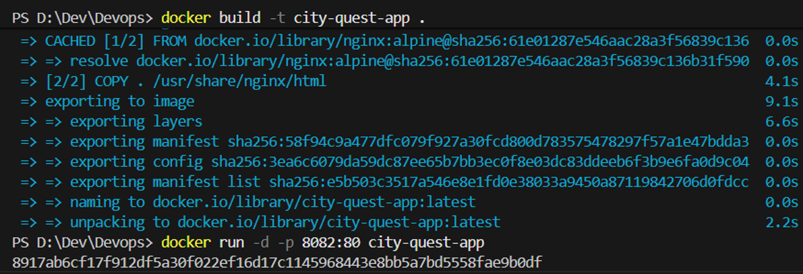
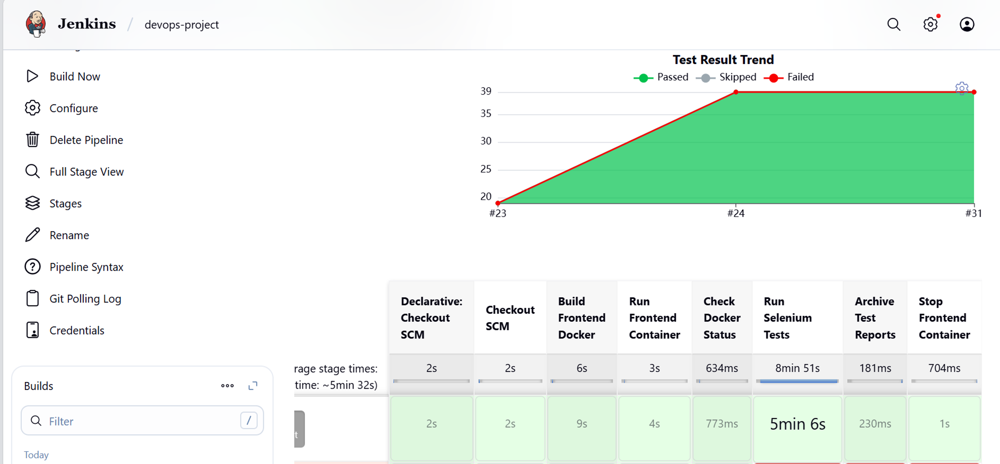
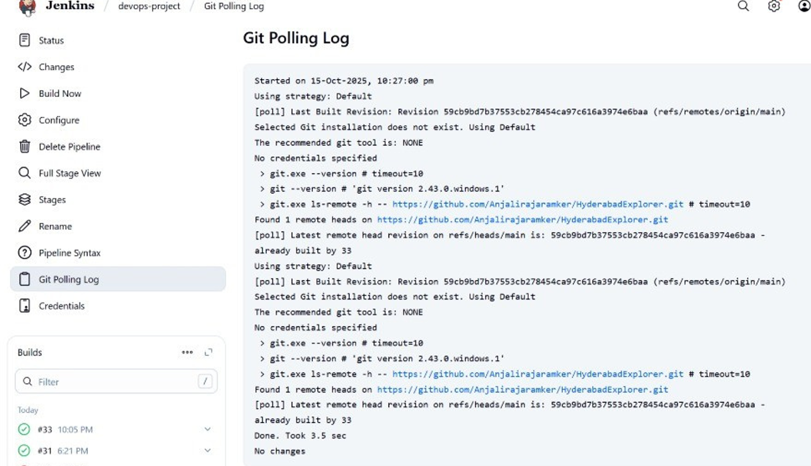
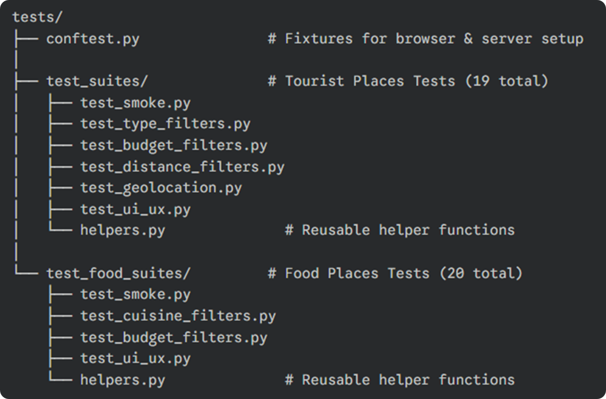
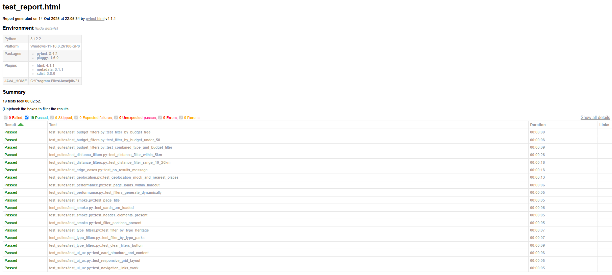

# 🏛️ City Quest: Discover the City of Pearls

**CITY QUEST** is a dynamic web application containing essential information about must-visit places for any tourist visiting Hyderabad. **This project was specifically built as a practical sandbox to understand, implement, and master CI/CD environments and modern DevOps workflows.** While it functions as a complete tourist and food guide—powered by custom web scraping and a dynamic UI—its primary architecture was designed from the ground up to showcase containerization, automated Selenium testing, and Jenkins deployment pipelines.

## 🎯 Project Vision
- **DevOps Integration:** Develop a fully automated and containerized web application using modern DevOps tools.
- **Version Control:** Integrate Git and GitHub for seamless collaboration and code management.
- **Continuous Integration/Deployment:** Ensure CI/CD through robust Jenkins pipelines.
- **Containerization:** Employ Docker to guarantee consistent setup and easy deployment across environments.
- **Automated Testing:** Implement automated testing with Selenium for improved reliability and performance validation before release.

## ✨ Features
- **Interactive Destinations:** Browse a curated list of top attractions in Hyderabad complete with timings, entry fees, and nearby metro stations.
- **Dynamic Filtering:** Smart filters for destinations and food places based on type, budget, and cuisine.
- **Geolocation & Distance:** Discover places near you with accurate distance markers.
- **Food Recommendations:** A dedicated section to explore the famous culinary delights of Hyderabad, dynamically linked to nearby attractions.
- **Data-Driven:** Content is managed via `data.json` and `food_places.json`, allowing for easy updates without changing the core HTML.
- **Web Scraping:** The extensive database of tourist attractions and food spots was curated by actively scraping real-world information from the internet.

## 🛠️ Tech Stack
- **Frontend:** HTML5, CSS3, Vanilla JavaScript (Static Site, No Backend)
- **Containerization:** Docker & Docker Compose (Served via Nginx Alpine container)
- **CI/CD:** Jenkins Pipeline
- **End-to-End Testing:** Python, Pytest, Selenium WebDriver

## 📸 Project Demonstration & Results

Below is a complete visual walkthrough of the containerization, CI/CD pipeline execution, and automated testing results for City Quest:

### 1. Local Containerization (Docker Build & Run)
Successful local build of the Alpine-Nginx Docker image and initialization on port `8082`:


### 2. Jenkins CI/CD Pipeline Stage View & Test Trend
The automated stage view execution in Jenkins, showing build durations alongside the rising green trend line of passing test suites (from 19 to 39 tests):


### 3. Automated SCM Git Polling Log
Jenkins polling log demonstrating automatic detection of repository code changes to trigger the pipeline:


### 4. Modular Pytest Test Suite Structure
The Pytest structure is organized modularly to split test cases between Tourist and Food pages:


### 5. Automated Test Execution Report
The generated Pytest HTML report validating 100% test success across all E2E test runs:



## 📂 Project Structure
```text
HyderabadExplorer/
├── Devops/                  # Core website application files
│   ├── index.html           # Tourist Places page
│   ├── home.html            # Landing page
│   ├── food-places.html     # Food recommendations page
│   ├── style.css            # Main stylesheet
│   ├── script.js            # Main application logic
│   ├── data.json            # Database for tourist places
│   └── food_places.json     # Database for food venues
├── selenium_tests/          # E2E test suite using Pytest + Selenium
├── Dockerfile.frontend      # Docker build instructions for Nginx
├── docker-compose.yaml      # Compose file for easy local deployment
└── Jenkinsfile              # CI/CD automated pipeline definition
```

## 🚀 Getting Started (Local Development)

The easiest way to run the application is using Docker Compose.

### Prerequisites
- [Docker Desktop](https://www.docker.com/products/docker-desktop/) installed on your machine.

### Running the App
1. Clone this repository:
   ```bash
   git clone https://github.com/Anjalirajaramker/HyderabadExplorer.git
   cd HyderabadExplorer
   ```
2. Start the application via Docker Compose:
   ```bash
   docker-compose up -d
   ```
3. Open your browser and navigate to:
   **[http://localhost:8888](http://localhost:8888)**

## ⚙️ CI/CD Pipeline (Jenkins)

This project features a fully automated Continuous Integration and Continuous Deployment pipeline configured via the `Jenkinsfile`. 

**Pipeline Stages:**
1. **Checkout SCM:** Pulls the latest code from the `main` branch.
2. **Build Frontend Docker:** Builds the custom Nginx image serving our application.
3. **Run Frontend Container:** Spins up the container on port `8888`.
4. **Run Selenium Tests:** Executes headless browser tests against the live container to verify UI functionality and routing.
5. **Archive Test Reports:** Saves the JUnit XML test results and HTML reports in Jenkins.
6. **Teardown:** (Post-action) Safely stops and removes the test container to free up system resources.

## 🧪 Automated Testing

We use Selenium WebDriver and Pytest to perform rigorous End-to-End testing on the application.

**Test Suite Summary:**
- **Testing Framework:** Python + Selenium WebDriver + Pytest
- **Total Tests:** 39 Automated Tests
- **Execution Time:** ~5 minutes
- **Success Rate:** 100% Automation Coverage of all critical user flows.
- **Pages Tested:** 2 (Tourist Places, Food Places)

**Test Breakdown:**
- 🟢 **Smoke Tests:** 8
- 🟢 **Filter Functionality Tests:** 17
- 🟢 **Geolocation & Distance Tests:** 3
- 🟢 **UI/UX & Interaction Tests:** 11

**To run tests manually:**
1. Ensure the Docker container is running (`docker-compose up -d`).
2. Install the Python dependencies:
   ```bash
   python -m pip install pytest selenium
   ```
3. Run the test suite:
   ```bash
   python -m pytest selenium_tests/
   ```
---
*Built with ❤️ for the city of Hyderabad.*